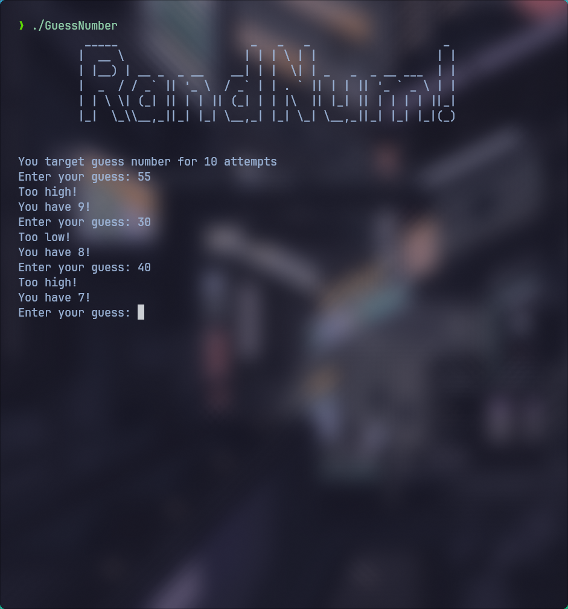

# Number Guessing Game 🎯

Welcome to my first C++ project! This is a simple console-based number guessing game where you try to guess the randomly generated number. The game will tell you if your guess is too high or too low, and you keep guessing until you find the correct number.


## Screenshots 🖼️

<p align="center">
    
</p>


## Project Structure 📁

```bash
NumberGuessingGame/
├── CMakeLists.txt    # CMake configuration file
├── src/              # Source files
│   ├── main.cpp      # Entry point of the game
│   ├── game.cpp      # Game logic implementation
│   └── player.cpp    # Player class implementation
├── include/          # Header files
│   ├── game.h        # Game class definition
│   └── player.h      # Player class definition
└── build/            # Build directory (created during the build process)
```


## Installation & Build Instructions 🛠️

Install my-project with git:

```bash
git clone https://github.com/df1gg/GuessNumber.git
cd GuessNumber
```
Create a build directory:
```bash
mkdir build
cd build
```

Run CMake and build:
```bash
cmake ..
cmake --build .
```

Run the executable:
```bash
./GuessNumber
```

That's it! Enjoy the game! 🎉
